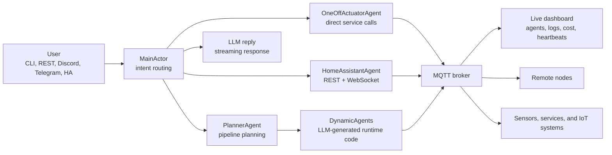

<p align="center">
  
</p>
<p align="center">
  <picture>
    <source media="(prefers-color-scheme: dark)"  srcset=".github/assets/title-dark.svg">
    <source media="(prefers-color-scheme: light)" srcset=".github/assets/title-light.svg">
    
  </picture>
</p>

<p align="center"><strong>AI agents that don't stop when you close the tab.</strong></p>

<p align="center">Long-running &nbsp;·&nbsp; distributed across nodes &nbsp;·&nbsp; self-healing &nbsp;·&nbsp; spawned by prompt</p>

<p align="center">
<a href="https://docs.waldiez.io/wactorz/">Docs</a> |
<a href="https://docs.waldiez.io/wactorz/guide/development.html">Installation</a> |
<a href="docs/architecture.md">Architecture</a> |
<a href="ha-addon/DOCS.md">Home Assistant Addon</a> |
<a href="https://github.com/waldiez/wactorz/issues">Issues</a>
</p>

<p align="center">
<a href="LICENSE"></a>
<a href="https://python.org"></a>
<a href="https://mosquitto.org"></a>
<a href="ha-addon/DOCS.md"></a>
</p>

---

Wactorz is an actor-model multi-agent framework built for IoT and edge workloads.
You describe what you need. It writes the agents, wires them over MQTT, spawns them across your nodes, and keeps them alive through crashes, restarts, and node migrations.

---

## Why Wactorz

| | |
|---|---|
| **24/7 by design** | Agents run indefinitely on IoT hardware and edge devices — not just until the script exits. |
| **Distributed across nodes** | Spawn agents on Raspberry Pis, VMs, and laptops from one prompt. All visible in one dashboard. |
| **Self-healing supervision** | Erlang-style ONE_FOR_ONE restart per actor. One agent crashes, the rest keep running. |
| **Prompt-generated code** | Describe the automation in chat. The planner writes Python, spawns it, and wires the topics. |
| **Auto-discovery** | Agents publish capability manifests over MQTT. The orchestrator routes tasks automatically. |
| **Centralized persistence** | SQLite + Redis + Pickle shared across all actors. State survives restarts and node migrations. |
| **Node migration** | Move agents between machines. State follows. |
| **Sandboxed execution** | Dynamic agents run in isolated venv subprocesses. |
| **MQTT-native** | Every event, log, heartbeat, and sensor reading flows through topics — to agents, dashboard, or external systems. |
| **HA is one channel** | Home Assistant control, entity lookup, automations, and addon support — alongside Discord, Telegram, REST, and MCP. |
| **Offline capable** | Full Ollama support for air-gapped and local deployments. |
| **Cost tracking** | Token usage and USD spend tracked per agent, persisted across restarts. |

---

## Quick Start

```bash
git clone https://github.com/waldiez/wactorz
cd wactorz
pip install -e ".[all]"

# Start the MQTT broker
docker compose up -d mosquitto

# Set your provider, model, and key (or put them in .env)
export LLM_PROVIDER=anthropic   # anthropic | openai | ollama | nim | gemini
export LLM_MODEL=claude-sonnet-4-6
export LLM_API_KEY=your-key-here

python -m wactorz
```

Dashboard: `http://localhost:8888`

**No repo clone needed?** Pull straight from Docker Hub — see [docs/dockerhub.md](docs/dockerhub.md).

**Local model:**

```bash
ollama pull llama3
python -m wactorz --llm ollama --ollama-model llama3
```

Windows users: [docs/windows.md](docs/windows.md). Full deployment options: [docs/deployment.md](docs/deployment.md).

---

## What people build with it

**Reactive IoT pipelines**

```text
when a person is detected on the front door camera, turn on the porch light and send me a photo
if the living room CO2 goes above 1000 ppm, open the window and notify me
monitor all temperature sensors and alert if any reading looks anomalous
```

**Home automation that understands context**

```text
turn off everything in the bedroom except the air purifier
create an automation: dim the living room to 40% at sunset
what is the energy consumption of the kitchen appliances today?
```

**Distributed edge workloads**

```text
spawn a motion detection agent on rpi-garage
deploy a water leak detector on rpi-basement that texts me on WhatsApp
run inference on rpi-kitchen and send results back to the main dashboard
```

---

## Architecture



Every actor owns its work. MQTT carries all events. Persistence keeps everything durable.
The dashboard makes the invisible parts visible.

---

## Interfaces

| Interface | How to use it |
|---|---|
| CLI | `python -m wactorz` |
| Live dashboard | `http://localhost:8888` |
| REST API | `python -m wactorz --interface rest` |
| Discord | `python -m wactorz --interface discord` |
| Telegram | `python -m wactorz --interface telegram` |
| MCP server | `wactorz-mcp` |
| Flutter app | iOS/Android companion app for agents, chat, and activity feed |
| Home Assistant addon | One-click install inside the HA Supervisor |

---

## LLM Configuration

Three variables in `.env` (or exported) control the model:

```bash
# Options: anthropic | openai | ollama | nim | gemini | none
LLM_PROVIDER=anthropic

# Model ID — examples:
#   anthropic  →  claude-sonnet-4-6
#   openai     →  gpt-4o
#   ollama     →  llama3
#   nim        →  meta/llama-3.3-70b-instruct
#   gemini     →  gemini-2.5-flash
LLM_MODEL=claude-sonnet-4-6

# Generic key — used for anthropic / openai / nim / gemini
# For Ollama, set OLLAMA_URL instead (default: http://localhost:11434)
LLM_API_KEY=your-key-here
```

---

## Repository Map

| Path | What lives there |
|---|---|
| `wactorz/` | Python actor runtime, built-in agents, interfaces, monitoring, HA integration |
| `frontend/` | Vite + TypeScript + Babylon.js dashboard |
| `rust/` | Rust backend crates and MQTT/interface support |
| `mobile/` | Flutter companion app |
| `ha-addon/` | Home Assistant Supervisor addon |
| `docs/` | Markdown docs source |
| `infra/` | Mosquitto, Prometheus, OpenTelemetry, Fuseki, nginx, and HA configs |
| `tests/` | Python test suite and backend parity harness |

---

## Documentation

| Start here | For |
|---|---|
| [Quickstart](docs/quickstart.md) | First run and Windows setup |
| [Docker Hub](docs/dockerhub.md) | Run from Docker without cloning the repo |
| [Architecture](docs/architecture.md) | Actor system, supervision, MQTT flow |
| [Agents](docs/agents.md) | Built-in agents, recipes, and dynamic agents |
| [Pipelines](docs/pipelines.md) | Reactive automation patterns |
| [Remote nodes](docs/remote-nodes.md) | Edge deployment over SSH |
| [Interfaces](docs/interfaces.md) | CLI, REST, chat platforms, dashboard, MCP |
| [API reference](docs/api.md) | REST endpoints and payloads |
| [Deployment](docs/deployment.md) | Docker, native binary, systemd, staging, HA addon |
| [Prometheus](docs/prometheus.md) | Metrics and monitoring |
| [Technical reference](docs/reference.md) | Deeper internals |

---

## Contributors

<!-- ALL-CONTRIBUTORS-LIST:START - Do not remove or modify this section -->
<!-- prettier-ignore-start -->
<!-- markdownlint-disable -->
<table>
  <tbody>
    <tr>
      <td align="center" valign="top" width="14.28%">
        <a href="https://github.com/ounospanas">
          
          <br /><sub><b>Panagiotis Kasnesis</b></sub>
        </a>
        <br />
        <a href="#projectManagement-ounospanas" title="Project Management">📆</a>
        <a href="https://github.com/waldiez/wactorz/commits?author=ounospanas" title="Code">💻</a>
      </td>
      <td align="center" valign="top" width="14.28%">
        <a href="https://github.com/lazToum">
          
          <br /><sub><b>Lazaros Toumanidis</b></sub>
        </a>
        <br />
        <a href="https://github.com/waldiez/wactorz/commits?author=lazToum" title="Code">💻</a>
        <a href="#design-lazToum" title="UI & Design">🎨</a>
      </td>
      <td align="center" valign="top" width="14.28%">
        <a href="https://github.com/hchris0">
          
          <br /><sub><b>Chris</b></sub>
        </a>
        <br />
        <a href="https://github.com/waldiez/wactorz/commits?author=hchris0" title="Code">💻</a>
        <a href="#userTesting-hchris0" title="User Testing">📓</a>
      </td>
      <td align="center" valign="top" width="14.28%">
        <a href="https://github.com/amaliacontiero">
          
          <br /><sub><b>Amalia Contiero</b></sub>
        </a>
        <br />
        <a href="https://github.com/waldiez/wactorz/commits?author=amaliacontiero" title="Code">💻</a>
        <a href="#promotion-amaliacontiero" title="Promotion">📣</a>
      </td>
    </tr>
  </tbody>
</table>
<!-- markdownlint-restore -->
<!-- prettier-ignore-end -->
<!-- ALL-CONTRIBUTORS-LIST:END -->

Want to see your avatar here? Contributions of any kind are welcome — read [CONTRIBUTING.md](CONTRIBUTING.md) to get started.

---

## Contributing

| What | How |
|---|---|
| Found a bug | [Open an issue](https://github.com/waldiez/wactorz/issues/new?template=bug_report.yml) |
| Have an idea | [Start a discussion](https://github.com/waldiez/wactorz/discussions) |
| Want to code | Fork, branch, and open a PR against `main` |
| Docs, tests, UI | Same as above — every improvement counts |
| New agent recipe | Add it in `wactorz/catalogue_agents/` and open a PR |
| Home Assistant | HA integrations and addon config PRs are very welcome |

Read [CONTRIBUTING.md](CONTRIBUTING.md) for setup instructions, code style, and the PR process.

---

## License

[Apache 2.0](LICENSE). Free to use, modify, and distribute.
