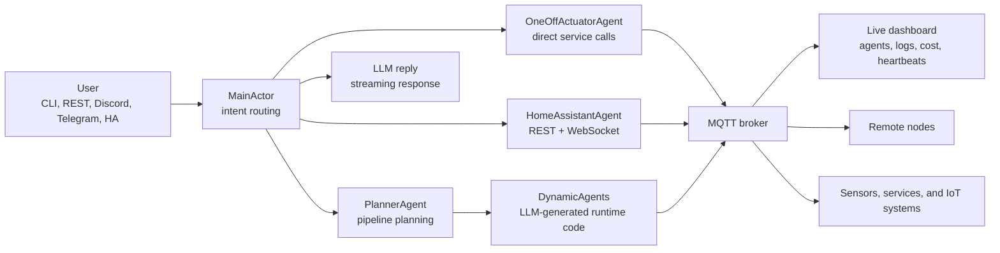

<p align="center">
  
</p>

# Wactorz

**Spawn, coordinate, and monitor AI agents at runtime just by talking to them.**

Wactorz is an actor-model multi-agent framework for real-world automation:
dynamic agents, MQTT wiring, Home Assistant control, remote nodes, persistent state,
live telemetry, and LLM cost tracking.

[Docs](https://waldiez.github.io/wactorz/) |
[Quickstart](docs/quickstart.md) |
[Architecture](docs/architecture.md) |
[Home Assistant Addon](ha-addon/DOCS.md) |
[Issues](https://github.com/waldiez/wactorz/issues)

[](LICENSE)
[](https://python.org)
[](https://mosquitto.org)
[](ha-addon/DOCS.md)
[](#contributors-)

---

## The Short Version

You describe an automation. Wactorz classifies the intent, asks the LLM for the code it needs,
spawns one or more agents, wires them through MQTT, persists their state, and monitors them while
they run.

```text
You:     monitor my kitchen temperature and alert me on Discord if it goes above 28 C

Wactorz: Understood. I will create two agents:

         temp-monitor-agent     polls sensors/temperature every 30s
         discord-notify-agent   sends the alert when the threshold is crossed

         Both agents are live. They will survive a restart automatically.
```

No restart. No hardcoded agent classes. No hand-written YAML pipeline.

---

## Why It Feels Different

| Capability | What it means in practice |
|---|---|
| Runtime agent spawning | New agents can appear while the system is already running. |
| Actor supervision | Each agent has its own mailbox, lifecycle, heartbeat, and restart policy. |
| MQTT-native wiring | Agent events, logs, heartbeats, sensor readings, and results flow through topics. |
| Home Assistant aware | Natural-language device control, entity lookup, automations, and HA Supervisor addon support. |
| Remote-node ready | Spawn agents on laptops, Raspberry Pis, VMs, and edge machines over SSH. |
| Offline capable | Use Ollama for local models when cloud APIs are not desired. |
| Provider flexible | Anthropic, OpenAI, Gemini, NVIDIA NIM, or Ollama. |
| Cost visible | Token usage and USD spend are tracked per agent and survive restarts. |

---

## Quick Start

```bash
git clone https://github.com/waldiez/wactorz
cd wactorz
pip install -e ".[all]"

# Local MQTT broker for native development
docker compose up -d mosquitto

# Pick an LLM provider
export ANTHROPIC_API_KEY=sk-ant-...

python -m wactorz
```

Open the dashboard:

```text
http://localhost:8888
```

Use a local model instead:

```bash
ollama pull llama3
python -m wactorz --llm ollama --ollama-model llama3
```

Windows users can use the helper script in [docs/windows.md](docs/windows.md).
Docker, systemd, native binary, staging, and Home Assistant deployments are covered in
[docs/deployment.md](docs/deployment.md).

---

## What You Can Build

### Reactive Pipelines

Describe the rule. Wactorz plans the agents, generates the code, wires the topics, and persists
the pipeline so it restores on restart.

```text
if the front door opens, send me a Telegram message
when a person is detected on my webcam, turn on the hallway light
whenever the living room temperature drops below 18 C, turn on the heater
```

### Home Assistant Control

Talk to your home like an API you do not have to memorize.

```text
turn off all the lights in the bedroom
set the thermostat to 22 degrees
create an automation: when the sun sets, dim the living room to 40%
what sensors do I have in the kitchen?
```

### Remote Agents

Deploy work to another machine and let it join the same live system.

```text
/deploy rpi-kitchen
spawn a temperature sensor on rpi-kitchen that reads from a DHT22 every 30 seconds
```

Remote nodes self-bootstrap over SSH and report back through the same dashboard and MQTT fabric.

### Always-On Monitoring

Every actor publishes a heartbeat. `MonitorAgent` watches for stale agents, warnings, failures,
and restarts. State is written to SQLite as it changes, not only on graceful shutdown.

---

## Architecture



The model is deliberately simple: actors own work, MQTT carries events, persistence keeps the
system durable, and the dashboard makes the invisible parts visible.

---

## Interfaces

| Interface | How to use it |
|---|---|
| CLI | `python -m wactorz` |
| Live dashboard | `http://localhost:8888` |
| REST API | `python -m wactorz --interface rest` |
| Discord | `python -m wactorz --interface discord` |
| Telegram | `python -m wactorz --interface telegram` |
| MCP server | `wactorz-mcp` |
| Flutter app | iOS/Android companion app for agents, chat, and activity feed |
| Home Assistant addon | One-click install inside the HA Supervisor |

---

## LLM Providers

| Provider | Environment variable | Notes |
|---|---|---|
| Anthropic Claude | `ANTHROPIC_API_KEY` | Default hosted provider |
| OpenAI | `OPENAI_API_KEY` | OpenAI-compatible hosted models |
| Google Gemini | `GEMINI_API_KEY` | Gemini models |
| NVIDIA NIM | `NIM_API_KEY` | NIM-hosted models |
| Ollama | none | Local, offline models |

---

## Repository Map

| Path | What lives there |
|---|---|
| `wactorz/` | Python actor runtime, built-in agents, interfaces, monitoring, HA integration |
| `frontend/` | Vite + TypeScript + Babylon.js dashboard |
| `rust/` | Rust backend crates and MQTT/interface support |
| `mobile/` | Flutter companion app |
| `ha-addon/` | Home Assistant Supervisor addon |
| `docs/` | Markdown docs source |
| `site/` and `static/` | Built documentation and bundled web assets |
| `infra/` | Mosquitto, Prometheus, OpenTelemetry, Fuseki, nginx, and HA configs |
| `tests/` | Python test suite and backend parity harness |

---

## Documentation

| Start here | For |
|---|---|
| [Quickstart](docs/quickstart.md) | First run and Windows setup |
| [Architecture](docs/architecture.md) | Actor system, supervision, MQTT flow |
| [Agents](docs/agents.md) | Built-in agents, recipes, and dynamic agents |
| [Pipelines](docs/pipelines.md) | Reactive automation patterns |
| [Remote nodes](docs/remote-nodes.md) | Edge deployment over SSH |
| [Interfaces](docs/interfaces.md) | CLI, REST, chat platforms, dashboard, MCP |
| [API reference](docs/api.md) | REST endpoints and payloads |
| [Deployment](docs/deployment.md) | Docker, native binary, systemd, staging, HA addon |
| [Prometheus](docs/prometheus.md) | Metrics and monitoring |
| [Technical reference](docs/reference.md) | Deeper internals |

---

## Contributors

<!-- ALL-CONTRIBUTORS-LIST:START - Do not remove or modify this section -->
<!-- prettier-ignore-start -->
<!-- markdownlint-disable -->
<table>
  <tbody>
    <tr>
      <td align="center" valign="top" width="14.28%">
        <a href="https://github.com/ounospanas">
          
          <br /><sub><b>Panagiotis Kasnesis</b></sub>
        </a>
        <br />
        <a href="#projectManagement-ounospanas" title="Project Management">📆</a>
        <a href="https://github.com/waldiez/wactorz/commits?author=ounospanas" title="Code">💻</a>
      </td>
      <td align="center" valign="top" width="14.28%">
        <a href="https://github.com/lazToum">
          
          <br /><sub><b>Lazaros Toumanidis</b></sub>
        </a>
        <br />
        <a href="https://github.com/waldiez/wactorz/commits?author=lazToum" title="Code">💻</a>
        <a href="#design-lazToum" title="UI & Design">🎨</a>
      </td>
      <td align="center" valign="top" width="14.28%">
        <a href="https://github.com/hchris0">
          
          <br /><sub><b>Chris</b></sub>
        </a>
        <br />
        <a href="https://github.com/waldiez/wactorz/commits?author=hchris0" title="Code">💻</a>
        <a href="#userTesting-hchris0" title="User Testing">📓</a>
      </td>
      <td align="center" valign="top" width="14.28%">
        <a href="https://github.com/amaliacontiero">
          
          <br /><sub><b>Amalia Contiero</b></sub>
        </a>
        <br />
        <a href="https://github.com/waldiez/wactorz/commits?author=amaliacontiero" title="Code">💻</a>
        <a href="#promotion-amaliacontiero" title="Promotion">📣</a>
      </td>
    </tr>
  </tbody>
</table>
<!-- markdownlint-restore -->
<!-- prettier-ignore-end -->
<!-- ALL-CONTRIBUTORS-LIST:END -->

Want to see your avatar here? Contributions of any kind are welcome -- read [CONTRIBUTING.md](CONTRIBUTING.md) to get started.

---

## Contributing

Wactorz is built in the open and all kinds of contributions are welcome.

| What | How |
|---|---|
| Found a bug | [Open an issue](https://github.com/waldiez/wactorz/issues/new?template=bug_report.yml) |
| Have an idea | [Start a discussion](https://github.com/waldiez/wactorz/discussions) |
| Want to code | Fork, branch, and open a PR against `main` |
| Docs, tests, UI | Same as above -- every improvement counts |
| New agent recipe | Add it in `wactorz/agents/` and open a PR |
| Home Assistant | HA integrations and addon config PRs are very welcome |

Read [CONTRIBUTING.md](CONTRIBUTING.md) for setup instructions, code style, and the PR process.

---

## License

[Apache 2.0](LICENSE). Free to use, modify, and distribute.
