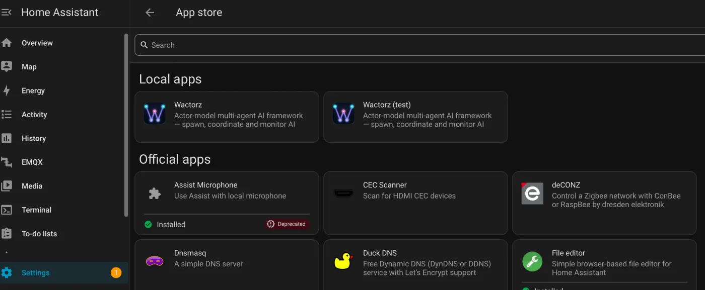
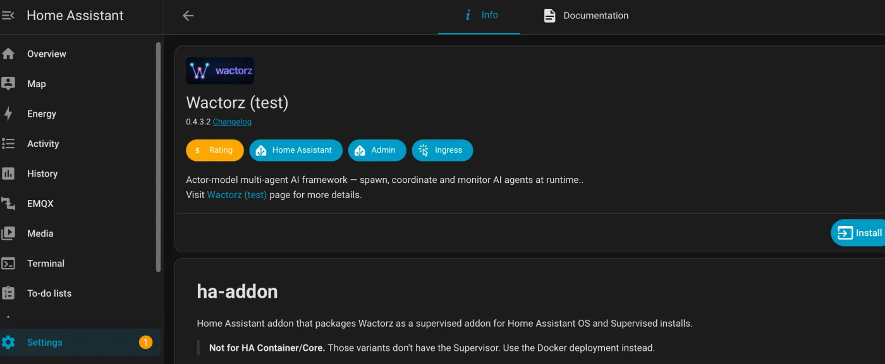
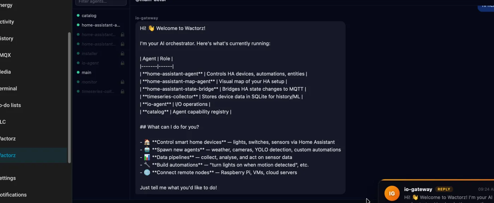
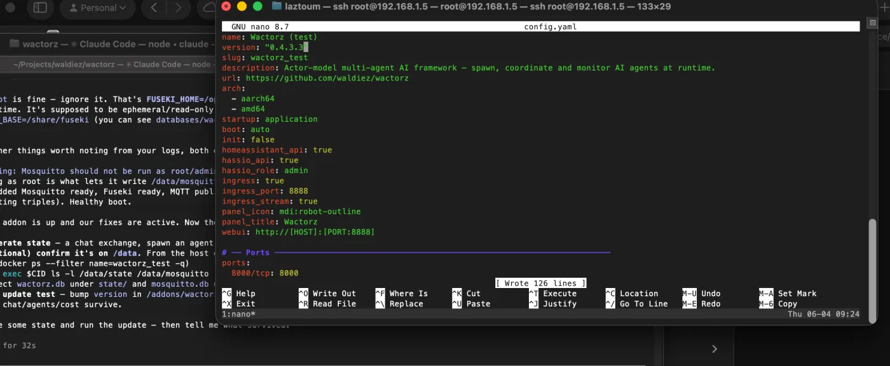
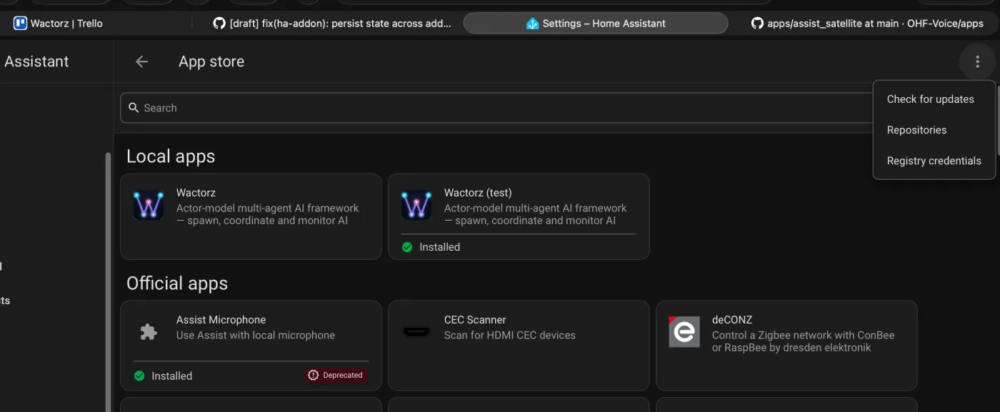
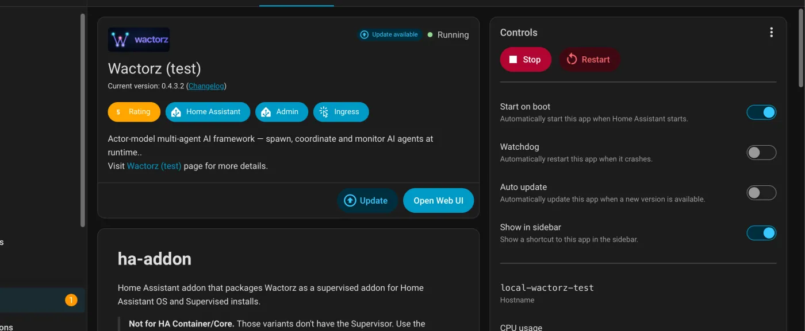
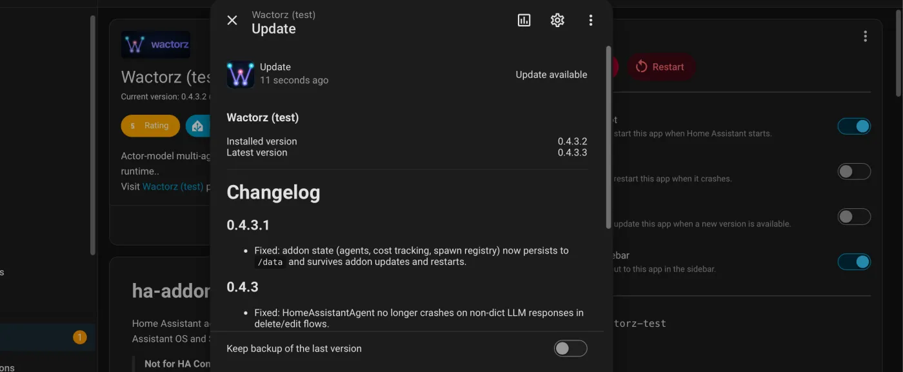
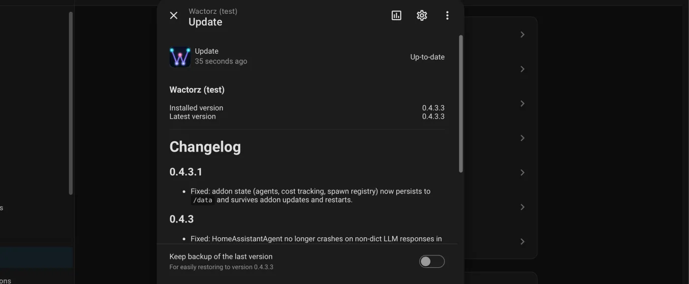
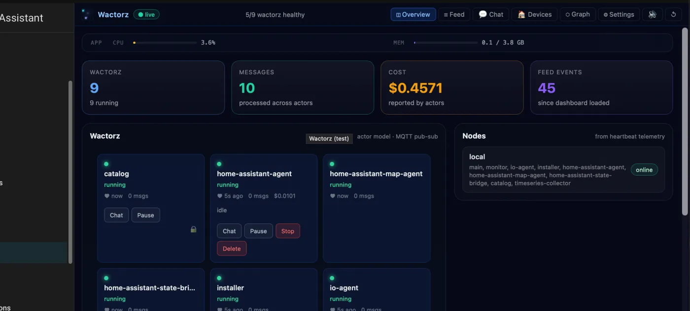

# Testing the add-on locally (local add-on workflow)

Validate add-on changes — **especially state persistence across updates** — on a
real Home Assistant OS box **without** pushing to the store or triggering an
update for everyone running Wactorz.

> Why this exists: persistence bugs only show up on a real **update** (the
> container is recreated, and only `/data` survives). Testing with a plain
> `docker restart` keeps the whole container filesystem and hides the bug —
> which is exactly how a broken fix once slipped through. This workflow
> reproduces the real failure mode.

---

## Mental model: there are two sources

When Supervisor builds the add-on, the pieces come from **two different places**:

| Piece | Comes from | How you change it for a test |
|---|---|---|
| `config.yaml`, `Dockerfile`, `run.sh` | the add-on **files** Supervisor reads from disk | edit the local copy on the host |
| the `wactorz` Python package | pulled **inside the Dockerfile** via `pip install … git+…@main` | repoint that `@main` at your branch |

**Takeaway:** `run.sh` changes are picked up from your local copy with no git at
all. **Python** changes (`wactorz/…`) are only picked up if your branch is
**pushed** *and* the Dockerfile's `pip` ref points at it. Merging to `dev` does
**not** make the real add-on use new Python — the ref is `@main`.

---

## 1. Copy the add-on into the local add-ons folder

Get a shell on the host (the **Advanced SSH & Web Terminal** add-on, or Samba),
then copy the **contents** of this repo's `ha-addon/` into a new folder under the
local add-ons directory (note the trailing `/.` — it copies contents, not the
folder):

```sh
mkdir -p /addons/wactorz-test
cp -r /path/to/repo/ha-addon/. /addons/wactorz-test/
```

> ⚠️ `config.yaml`, `Dockerfile`, and `run.sh` must sit at the **top level** of
> `/addons/wactorz-test/`. If you end up with `/addons/wactorz-test/ha-addon/…`,
> Supervisor won't detect it (no `config.yaml` at the top).

Give the test copy a **distinct name and slug** so it doesn't clash with the
store version, by editing `/addons/wactorz-test/config.yaml`:

```yaml
name: Wactorz (test)
slug: wactorz_test
```

## 2. Point the Python install at your branch (local-only)

Edit `/addons/wactorz-test/Dockerfile` — change the `pip install` ref:

```diff
- "wactorz[all] @ git+https://github.com/waldiez/wactorz.git@main"
+ "wactorz[all] @ git+https://github.com/waldiez/wactorz.git@your-branch"
```

> Your branch must be **pushed** to GitHub for this to resolve. This edit lives
> only on the host — **never commit it.** (`run.sh` is already the version you
> copied, so it needs no ref.)

## 3. Make Supervisor see it, then install

**Settings → Add-ons → Add-on Store → ⋮ → Check for updates.** The test copy
appears under **Local add-ons**.



Open it and **Install**, then **Start**.



## 4. Generate some state

Open the Web UI and create state you can check for later: chat with an agent,
spawn one or two, let some cost accrue.



## 5. Simulate an update

This is the whole point — an **update** recreates the container, so only `/data`
survives. A restart does **not** prove anything.

Bump `version` in `/addons/wactorz-test/config.yaml` (e.g. `0.4.3.2` → `0.4.3.3`):



Then **Add-on Store → ⋮ → Check for updates** so Supervisor notices the new version:



The add-on now shows **Update available** → click **Update**:



Confirm the version jump and start the update:



Wait for it to finish (Installed = Latest, "Up-to-date"):



## 6. Verify persistence

Open the Web UI again. **Chat history, agents, and cost should all still be
there** — the container was recreated, but state lived on `/data`.



Optionally confirm on disk, from the host debug shell (the one with `docker`):

```sh
CID=$(docker ps --filter name=wactorz_test -q)
docker exec "$CID" ls -l /data/state /data/mosquitto
# expect: state/wactorz.db  and (embedded MQTT) mosquitto/mosquitto.db
```

---

## Gotchas (the "avoid the mess" checklist)

- **Files at the top level** of the add-on folder — no nested `ha-addon/`.
- **Distinct `slug`** (`wactorz_test`) so it doesn't collide with the store add-on.
- **`Dockerfile` `@branch` is local-only** — never commit it; revert to `@main`.
- **`run.sh` is picked up locally** (no git). **Python needs the branch pushed.**
- **Test with an *update*, not a restart** — a restart can't reveal a persistence bug.
- Expected, harmless: `Warning: Mosquitto should not be run as root` — that's the
  `user root` setting that lets the broker persist retained messages to `/data`.
- Storage map: `/opt/fuseki` = the Fuseki **program** (in the image, ephemeral);
  `/share/fuseki` = Fuseki **data** (persistent); `/data` = add-on-private
  persistent store (chat/SQLite/pickle, embedded Mosquitto).

## Cleanup / shipping

- Remove the test add-on: uninstall it, then `rm -rf /addons/wactorz-test`.
- To ship the fix: merge your branch to `dev`, then `dev → main` (manual). Production
  add-ons build from `@main`, so they pick it up once it lands there — no Dockerfile
  ref change needed in production.
